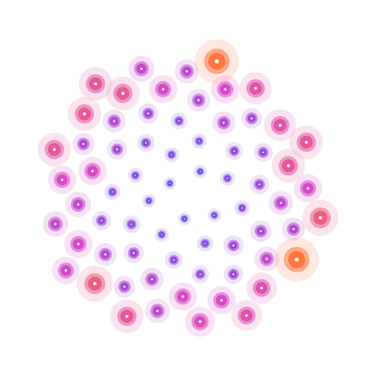

# OEIS-Mathematica




[](https://github.com/EnriquePH/OEIS-Mathematica/actions/workflows/mathics-offline.yml)
<!-- Once this repo is linked on Zenodo and a release has been cut (see
     Citation below), replace this line with the real badge, e.g.:
     [](https://doi.org/10.5281/zenodo.NNNNNNN) -->

Multipurpose package for using OEIS data from Wolfram Language.

This repository contains OEIS.m version 4.0.0, a streamlined package that uses
the official OEIS JSON API instead of scraping HTML pages. It is designed to
work on Wolfram Language 11, 13 and 14, and keeps the public functions of the
earlier package while being shorter, faster and more robust to future site
changes. Since 4.0.0 it ships as an installable Wolfram Language **paclet**.

The package exposes utilities to retrieve sequence descriptions, values, authors,
dates and export data in several formats such as BibTeX, HTML or plain text.

## Features

- Access to OEIS sequence metadata through the official JSON API
- Compatible with Wolfram Language 11, 13 and 14 (paclet installation needs 12.1+)
- Lightweight and easier to maintain than the previous HTML-based implementation
- Support for common package operations such as validation, import and export
- `OEISbFile` uses a locally defined `id[n_] := ...` to compute b-file terms
  beyond what OEIS has published, as documented on the [OEIS wiki page](https://oeis.org/wiki/User:Enrique_P%C3%A9rez_Herrero/OEIS_Package)
  for this package

## Install

**As a paclet** (recommended, WL 12.1+):

```wl
PacletInstall["https://github.com/EnriquePH/OEIS-Mathematica/releases/latest/download/OEIS-4.0.0.paclet"]
Needs["OEIS`"]
```

Or, working from a local clone without installing anything:

```wl
PacletDirectoryLoad["/path/to/OEIS-Mathematica"]
Needs["OEIS`"]
```

**Legacy `Get`**, for older Wolfram Language versions or a single-file drop-in
(this keeps working exactly as before 4.0.0):

```wl
Get["/path/to/OEIS-Mathematica/OEIS.m"]
```

## Tutorial

A full walkthrough with real, verified output is available at
[EnriquePH.github.io/OEIS-Mathematica](https://enriqueph.github.io/OEIS-Mathematica/)
and as a [Function Index](https://enriqueph.github.io/OEIS-Mathematica/functions.html).
The runnable, plain-script source for that tutorial is [test/OEISTutorial.wl](test/OEISTutorial.wl):

```
wolframscript -file test/OEISTutorial.wl
```

There is also a real Wolfram Notebook version, with the same live-executed
output, plus a guide page and one reference page per function:

- [`Documentation/English/Tutorials/OEIS.nb`](Documentation/English/Tutorials/OEIS.nb)
- [`Documentation/English/Guides/OEIS.nb`](Documentation/English/Guides/OEIS.nb)
- [`Documentation/English/ReferencePages/Symbols/`](Documentation/English/ReferencePages/Symbols/)

Regenerate them (they execute live against the OEIS API, so the captured
output stays accurate) with:

```
wolframscript -file DevTools/BuildDocumentation.wls
```

The original package page, with its own usage examples, is on the OEIS wiki:
[User:Enrique Pérez Herrero/OEIS Package](https://oeis.org/wiki/User:Enrique_P%C3%A9rez_Herrero/OEIS_Package).

## Quick start

Load the package in a Wolfram notebook with:

```wl
<<OEIS`
```

Example:

```wl
OEISImport["A000045", "Description"]
```

## Main functions

- OEISTotalNumberOfSequences
- OEISValidateIDQ
- OEISImport
- OEISURL
- OEISFunction
- OEISExport
- OEISbFile

See the [Function Index](https://enriqueph.github.io/OEIS-Mathematica/functions.html)
for full signatures, options and links to each reference page.

## Testing

```
wolframscript -file Tests/RunTests.wls            # everything, incl. live OEIS API calls
wolframscript -file Tests/RunTests.wls --offline   # ID validation / URL building only
```

CI (`.github/workflows/mathics-offline.yml`) runs the ID-validation/URL-building
subset on every push and pull request using [Mathics3](https://mathics.org), a
free, open-source Wolfram Language implementation, so it needs no Wolfram
Engine license. It runs `Tests/OfflineTests.mathics.wls`, a hand-ported mirror
of `Tests/OfflineTests.wlt` (Mathics3 doesn't implement `VerificationTest`/
`TestReport` or the live JSON API path, so the real `.wlt` suite and anything
network-dependent still needs a licensed `wolframscript` to run, e.g. locally
or in your own CI with `WOLFRAMSCRIPT_ENTITLEMENTID` configured).

## Benchmarks

```
wolframscript -file Benchmarks/Benchmark.wls
```

See [`Benchmarks/Benchmark.nb`](Benchmarks/Benchmark.nb) for a notebook with
captured timings and a chart (regenerate with
`wolframscript -file DevTools/BuildBenchmarkNotebook.wls`).

## Building the paclet

```
wolframscript -file DevTools/BuildPaclet.wls
```

Produces `build/OEIS-4.0.0.paclet`. Requires Wolfram Language 12.1+ (older
engines don't understand the `PacletInfo.wl` association format). Attach the
built archive to a GitHub Release manually with `gh release upload` (or the
GitHub web UI) after cutting the release.

## Project status

- Paclet source: `PacletInfo.wl`, `Kernel/`
- Backward-compatible loader: `OEIS.m`
- Documentation: `README.md`, [GitHub Pages tutorial](https://enriqueph.github.io/OEIS-Mathematica/), `Documentation/`
- Tests: `Tests/`
- Changelog: [CHANGELOG.md](CHANGELOG.md)
- License: [LICENSE](LICENSE)

## Citation

If you use this package in a project or publication, please cite it using the
metadata in [CITATION.cff](CITATION.cff).

To get a citable DOI through [Zenodo](https://zenodo.org/): sign in to Zenodo
with your GitHub account, enable this repository under
[Zenodo > GitHub settings](https://zenodo.org/account/settings/github/), then
cut a GitHub Release here. Zenodo archives it automatically and mints a DOI;
`.zenodo.json` already provides the metadata it will use. Once minted, add
the DOI to `CITATION.cff` (see the commented `identifiers:` block there) and
swap in the real badge at the top of this file.

## Contributing

Please read [CONTRIBUTING.md](CONTRIBUTING.md) before opening a pull request.

## Code of Conduct

Please review [CODE_OF_CONDUCT.md](CODE_OF_CONDUCT.md) before participating in the project.

## License

This project is distributed under the GNU General Public License v3.0.
